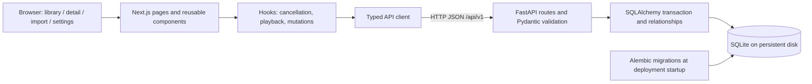
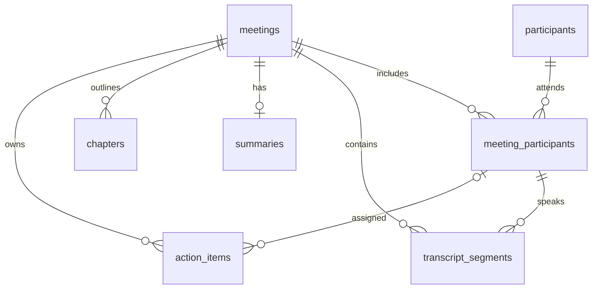

# Fireflies clone - meetings workspace

Separate Next.js App Router/TypeScript and FastAPI applications, with SQLite/SQLAlchemy persistence, Alembic migrations, Tailwind CSS, and shadcn/ui. The `/meetings` library and `/meetings/[id]` Overview, Transcript, and Action Items use live SQLite-backed data, with simulated transcript playback and persistent task management.

## Submission status and tech stack

This is a default-user post-meeting workspace for the Scaler SDE assignment. The public source repository is [madhavzer0oo0/firefliesclone](https://github.com/madhavzer0oo0/firefliesclone). **There is no verified hosted demo yet.** Deployment configurations are supplied below; a working public frontend link remains required before submission. The complete PDF requirement audit and verification evidence are in [docs/submission-audit.md](docs/submission-audit.md).

| Layer | Technology |
| --- | --- |
| Frontend | Next.js App Router, TypeScript, React, Tailwind CSS v4, local shadcn/ui components, Lucide icons, Sonner toasts |
| Backend | Python 3.11+, FastAPI, Pydantic v2, SQLAlchemy v2 |
| Persistence | SQLite, foreign-key enforcement, frozen Alembic migrations |
| Verification | pytest with migrated temporary databases, Playwright unit/browser tests, ESLint, TypeScript, production build |
| Deployment target | Vercel frontend; Render persistent disk or Railway volume for the FastAPI backend |

## Quick start on Windows

Requires Python 3.11+ and Node.js 20.9+ with npm. Run from the repository root:

```powershell
./scripts/setup.ps1
./scripts/init-db.ps1
./scripts/seed.ps1
./scripts/run-backend.ps1
# In another terminal:
./scripts/run-frontend.ps1
```

Frontend library: http://localhost:3000/meetings (`/` redirects here). API documentation: http://localhost:8000/docs. Health: http://localhost:8000/health.
Scripts stop on a failed command. If local PowerShell execution policy blocks scripts, run the commands below directly rather than changing machine-wide policy.

## Linux/macOS or manual setup

```sh
cd backend
python3 -m venv .venv
.venv/bin/python -m pip install -r requirements.lock.txt
.venv/bin/python -m alembic upgrade head
.venv/bin/python -m app.seed
.venv/bin/python -m uvicorn app.main:app --reload --host 127.0.0.1 --port 8000
# Another terminal, from repository root:
cd frontend
npm ci
npm run dev
```

On Windows substitute `.venv/Scripts/python.exe` and `python` for the corresponding Python commands.
The database defaults to `backend/fireflies.db` regardless of your current directory. Copy `backend/.env.example` to `backend/.env` and `frontend/.env.example` to `frontend/.env.local` only when configuration overrides are needed. Relative `DATABASE_URL` overrides resolve against the service working directory. `CORS_ORIGINS` is a JSON list. `NEXT_PUBLIC_API_URL` includes `/api/v1` and is embedded at frontend build time. Keep `.env` files private.

## Architecture and database



The applications remain separate. Next.js has no duplicate data API. Browser requests go directly to FastAPI, with explicit CORS origins. Playback uses a local clock; all meeting content and successful CRUD writes come from SQLite.



| Table | Role and relationships |
| --- | --- |
| meetings | Title, UTC start, duration, processing/completed/failed status, source, created/updated timestamps |
| participants | Reusable person, unique lowercased email and name |
| meeting_participants | Many-to-many association; composite meeting/person primary key |
| transcript_segments | Meeting, participant speaker, ordered position, start/end seconds, text |
| summaries | One per meeting; overview and plain-text notes |
| chapters | Meeting outline, ordered position, title/description, start/end seconds |
| action_items | Meeting task, optional participant assignee, open/completed status, optional due date |

Meeting deletion cascades to membership, transcript, summary, chapters, and action items. Shared participants remain. Composite foreign keys enforce that speakers and assignees belong to their meeting. Removing referenced participants is rejected by the API. Summary meeting IDs and timeline positions are unique; timing and status have database checks. Indexes support date sorting, status/title, email, participant lookup, timeline lookup, and task status/assignee.

SQLite stores UTC datetimes without timezone metadata; API responses restore UTC explicitly. Meeting creation and date filters require timezone-aware input. Duration cannot be shortened below existing content. Transcript/chapters must have unique positions and non-overlapping ordered ranges within duration. Gaps are allowed. PUT validates all content before replacement and commits once.

`app/config.py` and `database.py` configure sessions; `models.py` owns the schema; `schemas.py` owns typed validation; `api.py` exposes HTTP routes. Alembic owns database initialization: startup does not silently create tables. Frontend API methods and DTOs are under `src/lib/api.ts` and `src/types/api.ts`; `ApiError` exposes HTTP status and validation detail. Components use local shadcn/ui source and semantic Tailwind theme tokens.

## API contracts

Prefix: `/api/v1`. Interactive request/response schemas: `/docs`; machine-readable contract: `/openapi.json`.

| Method | Path | Behavior |
| --- | --- | --- |
| GET | /meetings | `{items,total,limit,offset}` with search/filter/sort |
| POST | /meetings | Create metadata and participants; 201 with meeting |
| POST | /meetings/import | Atomically create metadata, parsed transcript, optional summary and tasks; 201 with meeting, segment_count, warnings |
| GET / PATCH / DELETE | /meetings/{id} | Read/edit metadata or delete; DELETE returns 204 |
| GET / PUT | /meetings/{id}/transcript | Read segments, optionally `q`; atomically replace array |
| GET / PUT | /meetings/{id}/summary | Read or upsert one summary |
| GET / PUT | /meetings/{id}/chapters | Read or atomically replace chapter array |
| GET / POST | /meetings/{id}/action-items | List with optional `status`; create (201) |
| GET / PATCH / DELETE | /meetings/{id}/action-items/{item_id} | Read/edit/delete a meeting-scoped task |

Unprefixed infrastructure endpoints: `GET /health` reports process liveness; `GET /ready` checks that the meeting table is readable (503 when unavailable). `/docs` and `/openapi.json` expose the full typed contracts.

Meeting list query parameters: `q` matches title or transcript text by default; with `search_scope=library` it matches title OR participant name/email. With `search_scope=everywhere`, `q` matches title OR participant OR transcript text. Independent `title` and `participant` filters combine with `q` using AND. Transcript matches expose a nullable `match` containing the first chronological segment ID, timestamp, speaker label, and bounded snippet. Other filters: `status`; inclusive `date_from`/`date_to`; `sort=started_at|title|duration_seconds`; `order=asc|desc`; `limit=1..100` (default 20); `offset>=0` (default 0). Default order is newest first; IDs break ties. Each list item includes a nullable `preview` from the stored summary overview, loaded with one batch query per page. Text matching is case-insensitive for ASCII and treats SQL wildcard characters literally. SQLite's default lower-case matching is not full Unicode case folding. This small dataset uses substring matching; title indexes do not accelerate arbitrary substring searches.

Example meeting creation:

```json
{
  "title": "Product planning",
  "started_at": "2026-10-08T10:00:00+05:30",
  "duration_seconds": 300,
  "source": "manual",
  "participants": [{ "name": "Priya Sharma", "email": "priya@example.com" }]
}
```

Creation returns participant IDs for subsequent transcript and task writes. Metadata is created first, then transcript/summary/chapters/tasks can be submitted through their endpoints. Transcript and chapter PUT accept arrays, including `[]` to clear. Summary PUT requires `overview` and defaults `notes` to empty. Task creation requires `text`; assignee and deadline are optional. PATCH omission preserves fields; `assignee_id` and `due_date` accept null to clear. A participant's email resolves an existing person without renaming that person across other meetings.

Missing records return 404; invalid fields, timestamps, or memberships return 422; database conflicts return 409. Validation uses FastAPI's standard `detail` shape; relational validation uses a detail string. No authentication is implemented; this is a local default-user assignment workspace. CORS defaults to the two local frontend origins. Audio/video, bot integrations, and speech-to-text are out of scope; text transcript imports are supported. No calls to real AI services occur.

## Seed and migration workflow

The seed contains seven original 2.5-minute working meetings, five shared participants, 70 timestamped segments, seven summaries, 21 chapters, and 14 assigned action items. Each short conversation starts with context and ends with owners/next steps; transcripts are complete rather than excerpts. Every meeting has at least three speakers. Running the seed again preserves existing meetings and returns zero additions. Empty meetings are permitted during form creation/import.

```powershell
cd backend
./.venv/Scripts/python.exe -m alembic upgrade head
./.venv/Scripts/python.exe -m alembic check
# After changing models, create and review a new revision:
./.venv/Scripts/python.exe -m alembic revision --autogenerate -m "describe schema change"
```

Downgrading the initial revision removes all application tables and data; use only a disposable database for round-trip checks. Tests perform this on isolated temporary SQLite files.

## Verification

```powershell
./scripts/verify.ps1
# Or manually, using the project Python:
cd backend
./.venv/Scripts/python.exe -m pytest -q
cd ../frontend
npm run typecheck
npm run lint
npm run build
```

Tests initialize their databases from the actual migration and exercise CRUD persistence, literal search and filters, pagination/sort, transcript replacement rollback, timeline validation, cross-meeting references, summary upsert, task completion, seed completeness/idempotence, cascade deletion, CORS, and migration upgrade/downgrade/schema parity. Frontend builds need neither a running backend nor remote fonts.

The typecheck script first runs `next typegen` so it also works on a clean checkout without a previous build. Next.js generates `next-env.d.ts` locally; it is ignored in Git. The framework-generated `frontend/AGENTS.md` provides additional version-specific guidance.

## Meetings library

The dashboard's **Create meeting** action opens `/meetings/new`, a responsive transcript import form with required title, local date/time, duration in minutes, and participants (name/email). Add/remove participants, paste text or choose a file, optionally enter a saved summary and one pending/unassigned task per line, and create. Success navigates to the saved detail page. No audio is transcribed and no AI summary is generated. Errors retain the draft and do not leave a partial meeting.

### Transcript import contract

`POST /api/v1/meetings/import` accepts a JSON request containing `title`, timezone-aware `started_at`, positive integer `duration_seconds`, at least one participant, and `transcript: {format, content, filename?}`. The browser reads uploaded files using fatal UTF-8 decoding; the backend parses their content. Supported extensions are `.txt`, `.vtt`, and `.json` (case-insensitive); filename and format must agree. Maximum UTF-8 content size is 1 MiB, 2,000 segments, 100 total participants/imported identities, and 500 tasks. Names and emails must be unique within the supplied participant list. Labels match participant names case-insensitively.

- **TXT:** timestamped entries use `[MM:SS.mmm] Speaker: text` or `HH:MM:SS Speaker: text`; milliseconds and brackets are optional. Untimestamped continuation lines append to the preceding entry. Start timestamps are preserved; ends use the next start or meeting duration (`timing_source=inferred_end`).
- **Unstructured TXT:** each nonempty line becomes a segment, evenly spaced across the stated duration (`timing_source=estimated`). A leading `Speaker: text` prefix is treated as an explicit label; otherwise the label is **Unknown speaker**. Timing is an estimate, not inferred from audio. The detail transcript shows this provenance after refresh.
- **VTT:** `WEBVTT` header, cue identifiers/settings, multiline text, notes/style/region blocks, and `<v Speaker>` voice labels are supported. HTML entities are decoded and cue markup removed. Start/end timestamps, including fractional seconds, are preserved. Split cues containing multiple voices or overlapping ranges before importing.
- **JSON:** an array of `{speaker?, start_seconds, end_seconds?, text}` objects or `{segments, summary?, action_items?}`. Numeric timestamps are seconds; string timestamps may be seconds or `MM:SS[.mmm]` / `HH:MM:SS[.mmm]`. Missing speaker becomes Unknown speaker; missing end uses the next start/duration. Segments are sorted chronologically; overlaps, empty text, nonfinite/negative timestamps, and ranges beyond duration are rejected.

Speaker labels are stored separately from shared participant names, preserving their supplied spelling. Unmatched labels get imported identities with generated `@transcript.invalid` placeholder emails; these are not real contact addresses. Unlabeled text is never attributed to the first participant. Import warnings describe estimated/inferred timing and placeholder identities.

Optional `summary` accepts `{overview, notes?}`; optional `action_items` accepts `{text, assignee?, status?, due_date?}` objects. An assignee must match a participant label or email; omitted assignees remain unassigned. Explicit top-level summary/tasks override those embedded in a JSON transcript. A successful import returns `{meeting, segment_count, warnings}`. Parser errors return 422 with a transcript-specific location/message; metadata uses standard Pydantic validation. Every write commits in one transaction.

```json
{
  "title": "Product planning",
  "started_at": "2026-10-08T10:30:00+05:30",
  "duration_seconds": 60,
  "participants": [{"name": "Priya", "email": "priya@example.com"}],
  "transcript": {
    "format": "json",
    "filename": "planning.json",
    "content": "[{\"speaker\":\"Priya\",\"start_seconds\":0.5,\"end_seconds\":30.75,\"text\":\"Ship the plan.\"}]"
  },
  "summary": {"overview": "The plan was approved."},
  "action_items": [{"text": "Ship the plan", "assignee": "Priya", "status": "open"}]
}
```

Run `scripts/init-db.ps1` on existing checkouts to apply the fractional timestamp/provenance migration. It preserves stored meetings, transcript constraints, membership foreign keys, and indexes. Downgrading that revision loses fractional precision and import provenance; use disposable databases for downgrade tests. Creation browser tests use `scripts/test-e2e.ps1` with isolated SQLite and clean up their own meetings.

The library follows the icon rail, channel sidebar, purple active states, date-grouped cards, and compact search/filter controls shown in [Fireflies' official Meetings guide](https://guide.fireflies.ai/articles/4827382971-learn-about-fireflies-notebook). No user-attached screenshot was available in the implementation turn, and browser automation could not open the logged-in session; official current product screenshots supplied the visual reference.

- `components/workspace/`: reusable navigation, header, and toast provider.
- `components/meetings/`: library composition, filters, cards, skeletons, empty/error states.
- `hooks/use-meetings.ts`: debouncing, request cancellation, stale-response protection, retries.
- `lib/meetings.ts`: API query construction, local-date boundaries, formatting, error messages.
- Cards come entirely from FastAPI. Filtering and pagination run in the backend, with 12 results per page. Search supports title or participant; advanced filters support title AND participant AND local-calendar date ranges. Enable transcript content in Filters for highlighted snippets linking to `/meetings/[id]?tab=transcript&segment=ID&q=QUERY`. No frontend fixture cards are rendered.
- The default-user workspace has no ownership/sharing model, so My Meetings and All Meetings show the same accessible records. Integrations, custom channels, profiles, and voice-agent controls are explicit placeholders. Settings is a real page with clearly disabled previews.
- Meeting links navigate to `/meetings/{id}`, which displays a real Overview with summary, saved discussion points, chapters, and action-item previews.

## Meeting detail / Overview

The detail page follows the summary/transcript panel pattern from [Fireflies' official Notepad guide](https://guide.fireflies.ai/articles/6653885315-learn-about-the-fireflies-notepad). No attached detail screenshot was available in the implementation message; the official product screenshots supplied the visual reference.

- Reuses the existing sidebar in a compact rail, with expandable workspace navigation. Header shows title, UTC-backed date in viewer-local time, duration, source, status, and a participant disclosure with every name/email.
- Overview is the default tab. The Transcript tab expands the live transcript panel; switching tabs preserves playback and search. Action Items supports persistent task management.
- `components/meeting-detail/` separates header, tabs, overview sections, context panel, and loading/error states. `lib/meeting-detail.ts` composes the existing REST endpoints; `hooks/use-meeting-detail.ts` handles cancellation, stale-response protection, and refresh. No backend or schema changes were needed.
- Metadata loads first. Summary, chapters, action items, and transcript then load concurrently. Section failures are isolated; missing summary content receives an empty state, while a missing meeting receives an explicit missing-meeting state. Invalid nonnumeric/unsafe IDs return a route 404.
- Displays the complete saved overview and notes, with notes split into discussion points without generating text. Chapters display actual timestamps/descriptions and support expansion. The preview shows up to three actual tasks with assignees, deadlines, and status; Manage action items opens the editable Action Items tab.
- Copy summary, copy link, refresh/retry, participant disclosure, chapter expansion, back navigation, metadata editing, deletion, and section links work. Summary editing, sharing, regeneration, and other future detail controls are disabled. No LLM service is called.
- Direct links and browser refresh work without first visiting the library. Builds do not fetch backend data.

### Browser verification

The task checklist and assignment controls follow [Fireflies' official Tasks Feed guide](https://guide.fireflies.ai/articles/1574234155-learn-about-the-tasks-feed), using the existing meeting page's spacing, colors, and icons.

Action Items displays pending/completed groups with persistent checkboxes, participant assignees, optional deadlines, add/edit dialogs, and confirmed deletion. All mutations use the existing FastAPI endpoints; successful responses update the shared detail snapshot and Overview preview. Failures retain the saved row or form draft, display an error, and allow retry. Editing description/assignee/date preserves completion status. Transcript search and playback remain mounted while switching tabs.

Run the entire suite, including real CRUD and reload persistence checks, against a disposable migrated/seeded SQLite database:

```powershell
# Stop the frontend on port 3000 first. The regular backend can keep running.
$env:PLAYWRIGHT_CHANNEL = 'msedge'
./scripts/test-e2e.ps1
```

The script uses API port 8001, starts the production frontend through Playwright, and restores the original API configuration/build afterward. Its database and logs remain under ignored `tmp/e2e-*/` for inspection. It never writes to `backend/fireflies.db`. Running `npm run test:e2e` directly skips the CRUD test unless isolated execution is explicitly enabled. Browser checks cover add/edit, assigned/unassigned tasks, complete/incomplete status, deletion/cancel, persistence through reload, validation/failure recovery, keyboard modal focus, other tabs, and responsive layouts.

Transcript segments are loaded from SQLite through FastAPI, sorted chronologically, and rendered with stable speaker colors. Clicking a segment, dragging the timeline, keyboard seeking, or moving between literal search matches seeks the same authoritative playback clock. Search highlights every occurrence and wraps next/previous navigation. Automatic scrolling follows the active segment; manual scrolling pauses following until Resume follow is selected.

No sample recording is present. The player explicitly displays **Simulated playback** and advances by monotonic elapsed time over the meeting duration. It pauses when the page is hidden, stops at the duration, and cleans up timers/listeners on pause or unmount. It produces no audio. Timestamp matching uses half-open ranges; gaps and the exact meeting end have no active segment. Run `npm run test:unit` for boundary, seeking, clock, and literal-search tests; `scripts/verify.ps1` includes them.

Start the seeded backend first, then build the frontend. Playwright starts the production frontend automatically unless a server is already running:

```powershell
cd frontend
npm run build
# Use an installed Edge browser on Windows:
$env:PLAYWRIGHT_CHANNEL = 'msedge'
npm run test:e2e
# Or omit the channel and install Playwright Chromium once:
npx playwright install chromium
```

Browser tests verify live data, title/participant search, participant/date filters, date validation, recency sorting, empty/reset states, loading/error/retry, keyboard search, settings navigation, and library layout/menu behavior at 375, 768, and 1440 pixels. Detail tests additionally verify direct navigation and refresh, full summary and notes, chapters/action previews, participant disclosure, clipboard controls, disabled future controls, missing meetings/invalid IDs, section-specific errors, empty content, and responsive layouts. Read tests leave saved records untouched; action CRUD tests require an isolated database and clean up their own records. Run against the original seeded dataset. Screenshots/traces are ignored under `frontend/test-results/`.

Audio recordings and a hosted demo remain future work. Nothing has been published or deployed by these setup scripts.

### Meeting management

Dashboard cards and detail headers expose actual PATCH editing and confirmed DELETE operations. Edit title, add participants, and remove unreferenced participants. Existing shared contact identities are read-only; removing a transcript speaker or task assignee is blocked by both UI and API. Successful edits update the detail snapshot without resetting playback or tabs; library writes, focus, visibility, and back navigation trigger fresh API reads. Deletion removes meeting-owned rows while keeping reusable contacts. Native dialogs trap focus, support Escape, restore focus, and block dismissal during writes. Server errors keep drafts open and never emit success feedback.

Management browser tests run only against the disposable migrated SQLite database via `scripts/test-e2e.ps1`; they cover edits, participant membership, delete confirmation, persistence, combined filters, global transcript navigation, failed requests, focus trapping, and responsive dialogs.

### Product styling and Settings

`src/app/product-polish.css` is the final shared visual layer after the route-specific styles, with consistent typography, contrast, controls, purple accents, dialog/error states, and responsive layouts. Mobile Overview keeps transcript access in the Transcript tab instead of duplicating the panel under the summary. The shared Button exposes `data-variant` for semantic styling. Toasts appear above the content rather than covering playback controls.

`/settings` is reachable from the sidebar and library header. Account, notifications, calendar, meeting bots, integrations, and privacy/access cards are explicit previews with disabled Coming Soon controls. Section links navigate to their cards; transcript import remains a working link. No settings persistence or external integrations are implied.

## Environment variables

| Variable | Service | Local default / production requirement |
| --- | --- | --- |
| `NEXT_PUBLIC_API_URL` | Frontend | `http://localhost:8000/api/v1`; public HTTPS API URL including `/api/v1` on Vercel. Compiled into the browser bundle: rebuild after changing it. |
| `DATABASE_URL` | Backend | Absolute `backend/fireflies.db` by default; production must explicitly use an absolute SQLite file inside the mounted volume. |
| `CORS_ORIGINS` | Backend | JSON list of `http://localhost:3000` and `http://127.0.0.1:3000`; production exact frontend HTTPS origin(s), without paths/trailing slashes. |
| `PERSISTENT_DATA_DIR` | Deployment entry point | Required absolute existing mounted directory, e.g. `/var/data` on Render or `/data` on Railway. |
| `SEED_ON_START` | Deployment entry point | `false` by default; Blueprint sets `true` to seed an empty demo once. Existing meetings are always preserved. |
| `PORT` | Deployment entry point | Platform-provided HTTP port; default 8000. Bind `0.0.0.0`, one process. |

The production entry point validates storage paths and origins, upgrades Alembic, optionally seeds, and then starts Uvicorn. Normal development commands remain explicit migration/seed steps. A directory existing does not prove it is persistent: attach a real hosting disk/volume and verify a restart before declaring persistence.

## Deployment instructions

### Vercel frontend

1. Import the GitHub repository into Vercel. Set **Root Directory = `frontend`**, framework Next.js, Node 22. `frontend/vercel.json` supplies `npm ci` and `npm run build`.
2. Set `NEXT_PUBLIC_API_URL` for Production to the actual backend HTTPS origin plus `/api/v1`. Do not use localhost, a guessed URL, or a placeholder domain. The Vercel build refuses missing/invalid public API configuration.
3. Deploy. Copy the actual frontend origin from Vercel and enter it in backend `CORS_ORIGINS` as a JSON list. Re-deploy the backend after changing origins. Add preview origins explicitly only when needed.
4. If the API URL changes, update the frontend variable and trigger a new build. Test `/meetings`, direct `/meetings/{id}`, `/meetings/new`, and `/settings` at the real public URL.

See [Vercel environment variable documentation](https://vercel.com/docs/environment-variables) for project environment and redeployment behavior.

### Render backend (primary option)

1. Push the deployment files to the public repository and create a Render Blueprint using root `render.yaml`. Review billing before creating the service: persistent disks require a paid service.
2. The Blueprint uses root `backend`, locked Python dependencies, one instance, and a 1 GB disk mounted at `/var/data`. It sets `DATABASE_URL=sqlite:////var/data/fireflies.db` and `PERSISTENT_DATA_DIR=/var/data`. Keep both paths aligned with the attached disk.
3. Set the prompted `CORS_ORIGINS` to `["https://YOUR-ACTUAL-FRONTEND-ORIGIN"]` (replace this placeholder). Start command is `python -m app.deployment`; health path is `/ready`.
4. Migrations and seeding run at **runtime after disk mount**. Do not move them into the build or pre-deploy command: Render disks are unavailable there. Startup seeding is idempotent and never overwrites an existing meeting library.
5. Copy the assigned public backend URL into Vercel's `NEXT_PUBLIC_API_URL`, build the frontend, then finish CORS configuration with the real Vercel origin. Keep a single backend instance; the SQLite file is not shared among independent disks/replicas.

The configuration follows [Render Blueprint fields](https://render.com/docs/blueprint-spec) and [persistent disk lifecycle](https://render.com/docs/disks). No Render service has been created or publicly verified during this audit.

### Railway backend (alternative)

1. Create a GitHub-backed service with **Root Directory = `/backend`** and select its `Dockerfile` build. Set the start command to `python -m app.deployment`, health check `/ready`, health timeout 120 seconds, restart on failure, and one replica in service settings. The Dockerfile installs locked dependencies and runs the same production entry point. New Railway services no longer accept legacy `railway.toml` configuration; use dashboard settings for this deployment.
2. Attach a Railway **volume** mounted at `/data`, then set `PERSISTENT_DATA_DIR=/data`, `DATABASE_URL=sqlite:////data/fireflies.db`, `SEED_ON_START=true`, and `CORS_ORIGINS` to the exact frontend HTTPS origin list.
3. Keep one replica, generate a public HTTPS domain, and use the platform `PORT`. Use `/ready` for health checks. Do not place the database in `/app` or another ephemeral image directory.
4. Set Vercel's API URL to the assigned domain plus `/api/v1`, rebuild, and run the public checks below. Volume attachment is a dashboard operation; a TOML file alone does not provision persistence.

See [Railway config-as-code](https://docs.railway.com/config-as-code) and [volume documentation](https://docs.railway.com/volumes). The Docker image and hosting configuration are prepared; an actual Railway deployment has not been verified.

### Public acceptance and backups

After deployment, run this read-only check with **actual** origins:

```sh
python scripts/check-public.py --frontend https://YOUR-FRONTEND --backend https://YOUR-BACKEND
```

It verifies public HTML routes/direct navigation, API readiness, populated content, and CORS including import preflight. It does not prove interactive CRUD or disk durability. In the public browser create a uniquely named disposable meeting, edit its title, add/complete a task, reload, then restart/redeploy the backend and confirm the same meeting/transcript/task remain. Delete only that test meeting afterwards. Check developer tools for mixed-content, localhost requests, CORS errors, and failed requests. Record both verified URLs and restart evidence in the submission checklist.

Back up SQLite using its online backup API (Python `sqlite3.Connection.backup`) to a separately retained destination; do not copy a live database file with uncheckpointed writes. Keep backups and uploaded/user data outside Git. Restore into a mounted disk and run Alembic before serving. Disk snapshots alone are not a substitute for verifying a database restore.

## Design decisions, assumptions, and limitations

- Seed content is original synthetic data: seven complete short meetings, saved summaries/notes/chapters, and assigned tasks. No clone repository code or real meeting recordings are used. User-supplied summary/task content is preserved; imported transcripts are not summarized automatically.
- The PDF permits seeded summaries, placeholder media, default-user authentication, and Coming Soon integrations. Playback is explicitly simulated; there is no audio, speech-to-text, live bot, LLM, CRM/calendar connection, or genuine sharing. Imported unstructured timings are visibly marked estimates.
- Speaker labels are separate from shared participant identities; composite membership keys prevent cross-meeting assignments. Referenced speakers/assignees cannot be removed from membership. Remove/reassign their content first using the API. Metadata editing never renames a contact globally.
- The playback reducer is the authoritative clock, matching half-open segment intervals. Gaps have no active segment. Pause, seek, visibility pause, timer cleanup, search navigation, and user-controlled auto-follow are tested.
- UTC storage and timezone-aware requests preserve date boundaries; the UI displays local dates. Transcript times support fractions, while duration/chapters use integer seconds. Transactions validate before replacing collections or importing.
- A single-instance SQLite backend is appropriate for this assignment dataset. Substring search is literal and ASCII case-insensitive, with deterministic pagination; it is not Unicode-aware full-text search. Horizontal scaling requires a database architecture change.
- This is a shared, unauthenticated demonstration workspace: public visitors can modify its data. Use synthetic content only. CORS controls browser origins, not authorization. Do not use this app for confidential production meetings.
- Optional global transcript search/snippets/deep links are implemented. Optional comments, soundbites, exports, tags, Ask AI, and dark mode are not implemented. The settings previews do not persist preferences.
- Visual references are official Fireflies guide screenshots; no attached dashboard/detail screenshot file was available in this workspace. Desktop/mobile layout checks pass, but pixel-perfect equivalence to an unavailable attachment cannot be certified.
- Hosting accounts, billed storage provisioning, a verified public application URL, and publishing the final local changes remain external submission steps. CI is supplied but its GitHub run must be verified after publication. The candidate must understand/explain the implementation in the interview; automated checks cannot certify that requirement.
